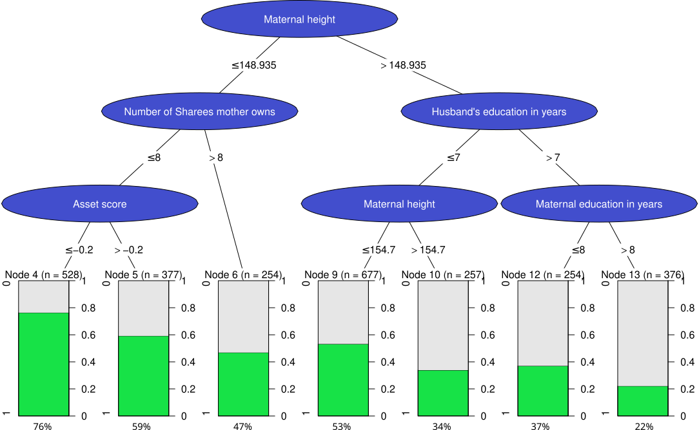

# Assignment 1

The modified graph is as follows.
Plot generated by tree package saved to an SVG file, then edited by Inkscape.
To be included in Rmd, it is converted to a png file.
The result is as follows.

```{r}

```

# Assignment 2

```{r setup2, include=FALSE}
###########################  Init code For Assignment 2 ########################
rm(list = ls())
knitr::opts_chunk$set(echo = TRUE)
```

## 2.1 Read file
```{r 2.1}
###########################  Code For Assignment 2.1 ###########################
# read data
# since there have different space count between columns, we use  read.table and use fill=TRUE
data <- read.table("SENIC.txt", header = FALSE, fill = TRUE)

# Assign column names
colnames(data) <- c("ID", "X1", "X2", "X3", "X4", "X5", "X6", "X7", "X8", "X9", "X10", "X11")

# Convert columns to appropriate types
data$ID <- as.integer(data$ID)
data$X1 <- as.numeric(data$X1)
data$X2 <- as.numeric(data$X2)
data$X3 <- as.numeric(data$X3)
data$X4 <- as.numeric(data$X4)
data$X5 <- as.numeric(data$X5)
data$X6 <- as.numeric(data$X6)
data$X7 <- as.integer(data$X7)
data$X8 <- as.integer(data$X8)
data$X9 <- as.integer(data$X9)
data$X10 <- as.integer(data$X10)
data$X11 <- as.numeric(data$X11)
```

## 2.2 Calculate outlier observations

```{r 2.2}
###########################  Code For Assignment 2.2 ###########################
calc_outlier_observations <- function(x) {

  # Compute the first and third quartiles
  Q1 <- quantile(x, 0.25)
  Q3 <- quantile(x, 0.75)
  IQR <- Q3 - Q1
  lower_bound <- Q1 - 1.5 * IQR
  upper_bound <- Q3 + 1.5 * IQR
  
  x[x < lower_bound | x > upper_bound]  # Return outliers
}  
```

## 2.3 Create a density plot of Infection risk in which outliers are plotted as a diamond symbol.

```{r 2.3.1}
###########################  Code For Assignment 2.3 ###########################
library(ggplot2)
# get the Infection Risk outliers
x3_outliers <- calc_outlier_observations(data$X3)

df <- data.frame(x = data$X3)
df_outliers  <- data.frame(x = x3_outliers)

graph2.3 <- ggplot(data = df, aes(x=x)) +
  geom_density(alpha = 0.5) +
  geom_point(data=df_outliers,aes(x=x,y=0),shape = 23, size = 3, fill = "blue") + 
  labs(title = 'Density plot of Infection risk', x = 'Infection risk') +
  theme(
    plot.title = element_text(hjust = 0.5)  # Center the title
  )

graph2.3
```

```{r 2.3.2,echo=FALSE}
print("Outliers are:")
print(data$X3[x3_outliers])
```

According to the graph and output above, we can see that the Infection risk follows some bell-shaped distribution, approximately a Gaussian distribution. Outlier data are located in the 2 tails of this distribution.

## 2.4 Produce graphs of the same kind as in step 3 but for all other quantitative variables in the data

```{r 2.4}
###########################  Code For Assignment 2.4 ###########################
library(gridExtra)

variables <- paste0("X", 1:11)

create_plot <- function(var_name,bw_val="nrd0") {
  # Calculate outliers
  outliers <- calc_outlier_observations(data[[var_name]])
  
  # Create data frames
  df <- data.frame(x = data[[var_name]])
  df_outliers <- data.frame(x = outliers)
  
  # Create the plot
  plot <- ggplot(data = df, aes(x = x)) +
    geom_density(alpha = 0.5,bw=bw_val) +
    geom_point(data = df_outliers, aes(x = x, y = 0), shape = 23, size = 3, fill = "blue") +
    ggtitle(paste("Density Plot for", var_name)) + 
    theme(
    plot.title = element_text(hjust = 0.5)  # Center the title
  )
  
  return(plot)
}

# Create a list of plots
plot_list <- lapply(variables, create_plot)

grid_layout <- arrangeGrob(grobs = plot_list, ncol = 3)

# Display the combined plot
grid.arrange(grid_layout)
```

## 2.5 Create a ggplot2 scatter plot showing the dependence of Infection risk on the Number of Nurses

```{r 2.5}
###########################  Code For Assignment 2.5 ###########################

df <- data.frame(x = data$X10,y = data$X3, bed=data$X6)
graph2.5 <- ggplot(data = df) + 
  geom_point(aes(x=x,y=y,color=bed)) + 
  scale_color_gradient(low = "lightblue", high = "darkblue") +
  labs(title = 'Scatter Plot', x = 'Nurse', y = 'Infection risk') +
  theme(
    plot.title = element_text(hjust = 0.5)  # Center the title
  )
graph2.5
```

## 2.6 Convert graph from step 3 to Plotly with ggplotly function
```{r 2.6, warning=FALSE, message=FALSE}
###########################  Code For Assignment 2.6 ###########################
library(plotly)
graph2.6 <- ggplotly(graph2.3)
graph2.6
```

## 2.7 Use pipeline operator to make a histogram of Infection risk, use diamond symbol when plot outliers
```{r 2.7, warning=FALSE}
###########################  Code For Assignment 2.7 ###########################
graph2.7 <- data.frame(X3 = data$X3) %>% 
  mutate(outliers = ifelse(X3 %in% calc_outlier_observations(X3), X3, NA)) %>%
  plot_ly() %>%
  add_histogram(x = ~X3, 
                marker = list(color = 'gray'),
                showlegend = FALSE) %>%
  add_markers(x = ~outliers, y = 0, 
              marker = list(color = 'blue', size = 10, symbol = 'diamond'),
              name = 'Outliers') %>%
  layout(title = "Histogram with Outliers",
         xaxis = list(title = "X3"),
         yaxis = list(title = "Count"))
  
graph2.7

```

## 2.8 Shiny App to do same thing as step 2.4
The shiny code listed below.
```{r 2.8}
###########################  Code For Assignment 2.8 ###########################
library(shiny)

# Define UI for application
ui <- fluidPage(
    titlePanel("Shiny App"),
    sidebarLayout(
        sidebarPanel(
            sliderInput("bw",
                        "Value of bw:",
                        min = 1,
                        max = 20,
                        value = 3)
        ),
        mainPanel(
            plotOutput(outputId = "distPlot")
        )
    )
)

# Define server logic
server <- function(input, output, session) {
  
  output$distPlot <- renderPlot({
    # Create a list of plots
    plot_list <- lapply(variables, create_plot, bw_val=input$bw)

    grid_layout <- arrangeGrob(grobs = plot_list, ncol = 3)

    # Display the combined plot
    graphs <- grid.arrange(grid_layout)
  })
}

# # Run the application 
shinyApp(ui = ui, server = server)
```